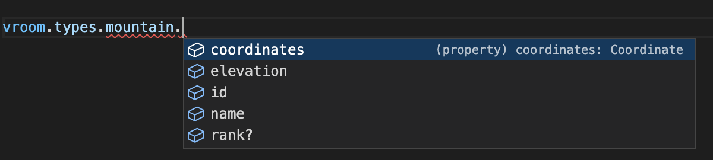

# Creating models

## Schema

A models schema is an object of fields you want to exist on your model. Each
field should have a type which should be a function that returns the type you
want.

It can be built-in constructors e.g. `String`, `Number` or `Boolean` or you can
cast more complex types yourself

Each field can also take an `optional: true`, that will signify that this prop
might not always be returned from the api.

```typescript
type Coordinate = {
  lat: Number;
  lon: Number;
};

const mountain = defineModel({
  schema: {
    name: { type: String },
    elevation: { type: Number },
    coordinates: { type: Object as () => Coordinate },
    rank: { type: Number, optional: true },
  },
});
```

The resulting types will be 
